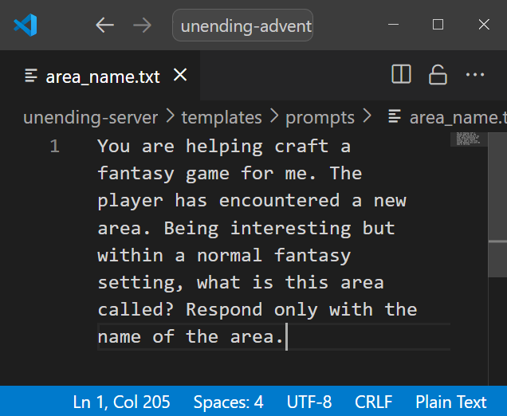
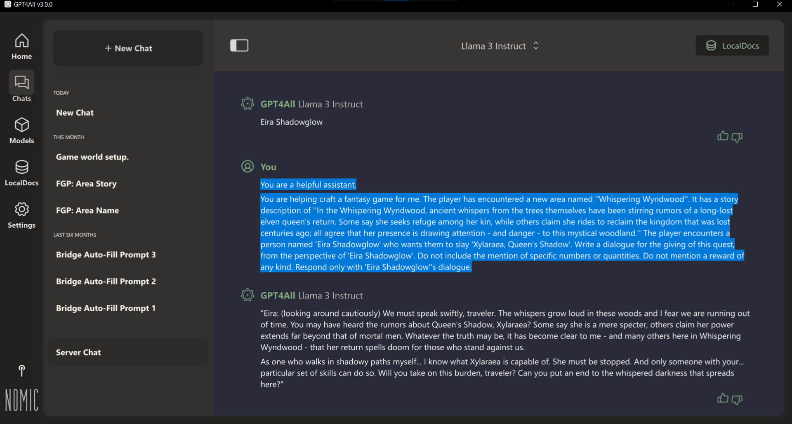
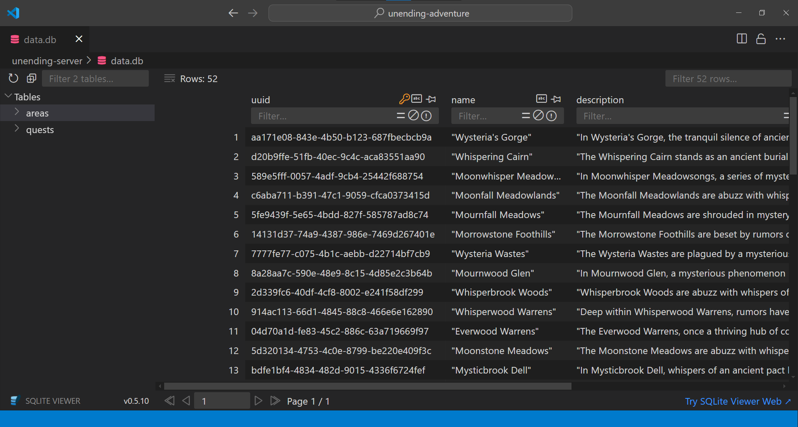
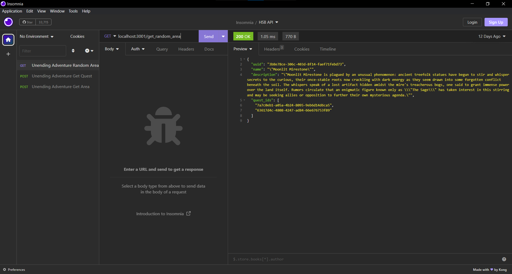
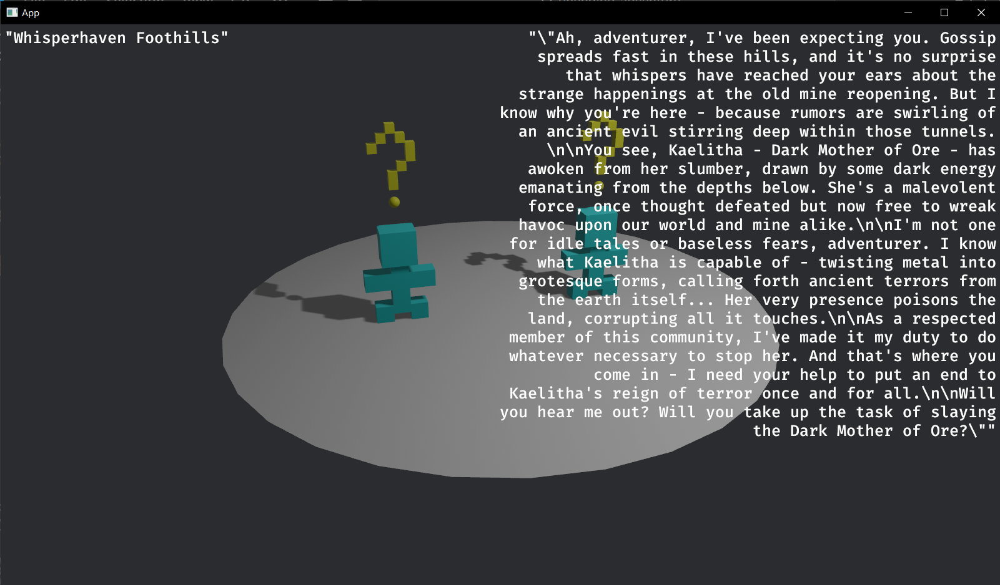

# Unending Adventure

## About

This is a project that seeks to answer the question of if fantasy-style game content can be auto-generated through the use of artificial intelligence.

More specifically - in its current state - it attempts to use Large Language Model (LLM) text inference to fill in area and quest details similar to the common types found in Massively Mulitplayer Online games (MMOs).

## Repository

This respository has two projects in it: the Server and the Client.

The Server is where content is generated, stored, and made deliverable. It talks to a local LLM chat via local HTTP requests, stores generated data in a SQlite database file, and hosts a web server with endpoints for data access.

The Client is a video game that uses HTTP requests to get data from the Server, and then uses that data to create a playable game world in a game engine.

## Tools

Both the Client and the Server are Rust projects, so any information on [Rust](https://www.rust-lang.org/) and [cargo tools](https://doc.rust-lang.org/cargo/) is highly relevant.

Throughout development, a tool called [Gpt4All](https://www.nomic.ai/gpt4all) was used in order to host a LLM chat. However, it should be noted that the Server uses fairly standard [OpenAI style API calls](https://platform.openai.com/docs/api-reference/completions/create), so a variety of tools should work properly.

Four main crates used in the project are [bevy](https://bevyengine.org/) as the game engine for the Client, [axum](https://github.com/tokio-rs/axum) for API hosting on the Server, [rusqlite](https://github.com/rusqlite/rusqlite) for SQlite reading and writing, and [reqwest](https://crates.io/crates/reqwest/) for HTTP-related functionality.

## Program

Firstly, the Server starts with (and fills, as necessary) LLM prompts read from text files.

Next, the Server feeds these configured prompts into a local LLM hoster like Gpt4All, and gets appropriate responses.

This gives the Server data to work with, which it stores in a local SQlite database.

The Server also runs a web server which makes this data accessible through HTTP requests.

The Client then uses web request to gather generated data and create a playable world.

## Contact

Feel free to contact me at benjamin.w.massey@gmail.com with any questions / inquiries.